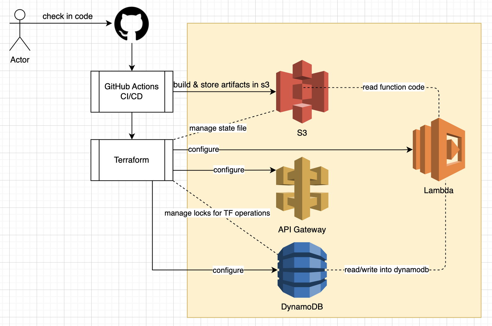

# Prerequisites
Create a bucket to store terraform state => waltergun51-terraform-remote-state-one	

# Installation - For shorturl service
```
cd infra
terraform init
terraform destroy
terraform init -lock=false
terraform apply -lock=false
# Ignore following errors - as the services are not found in S3 
│ Error: error creating Lambda Function (1): InvalidParameterValueException: Error occurred while GetObject. S3 Error Code: NoSuchKey. S3 Error Message: The specified key does not exist.
cd ..
```
# deploy application
```
cd newlink 
# perform dummy change in src/main.rs 
cd ../getlink 
# perform dummy change in src/main.rs 
cd ..
git add .
git commit -m "Dummy Change"
git push
```

# create new service ( eg. getlink )
```
# create service/project
cargo lambda new newsvc && cd newsvc
> Is this function an HTTP function? Yes
> Which service is this function receiving events from? Amazon Api Gateway HTTP Api
```
```
# Add required crates
cargo add tokio serde serde_json lambda_runtime
# change the code as per the requirement
```

### Testing
```
terraform output contains the value for invoke_url - Use github actions to locate.
invoke_url=https://vroptfnpm2.execute-api.ap-southeast-1.amazonaws.com
artillery quick --count 10 -n 20 $invoke_url
curl -X POST ${invoke_url}/newlink -d '{ "url": "http://google.com"}'  -H 'Content-Type: application/json'
curl -X GET ${invoke_url}/shortid
```

### Load Testing
```
npm install -g artillery
```
---
#### artillery quick --count 10 --num 100 $invoke_url/tJHxUD9YN
    errors.cookie_parse_error_invalid_cookie: ...................................... 30
    http.codes.200: ................................................................ 990
    http.codes.301: ................................................................ 990
    http.codes.302: ................................................................ 990
    http.codes.503: ................................................................ 10
    http.request_rate: ............................................................. 251/sec
    http.requests: ................................................................. 2980
##### Observed 503 error codes. ( server was unable to handle the load )
---

## Changed the billing mode to PROVISIONED, increased dynamodb read_capacity to 100 and tested with 1000 requests.
### https://github.com/wprabhakar/123456/commit/a79c5d6218bb0a1ea20079a4a4e225cb3aea97bc
#### artillery quick --count 10 --num 1000 $invoke_url/tJHxUD9YN
    http.codes.302: ................................................................ 504
    http.codes.429: ................................................................ 253
    http.request_rate: ............................................................. 78/sec
    http.requests: ................................................................. 757
    http.response_time:
      min: ......................................................................... 6
      max: ......................................................................... 548
      median: ...................................................................... 22.9
      p95: ......................................................................... 468.8
      p99: ......................................................................... 497.8
    http.responses: ................................................................ 757
##### No more 503 error codes.  But due to rate limiting 429 error codes appeared.

##### Next steps.  perform distributed load testing to avoid 429 errors to accurately measure the performance
---